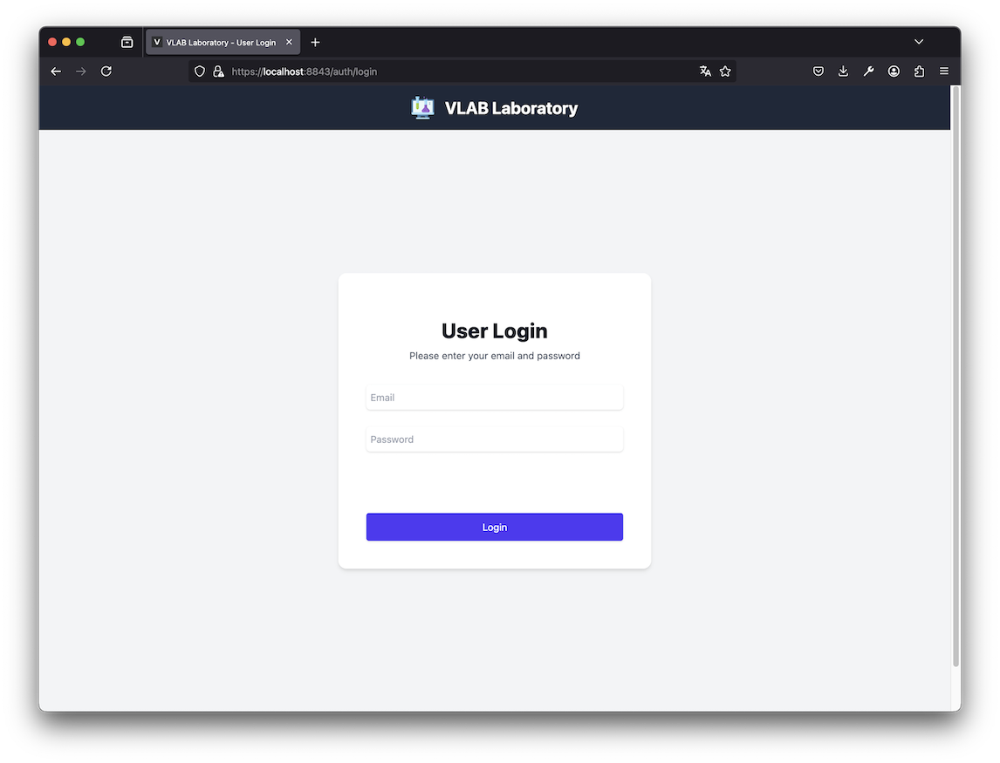
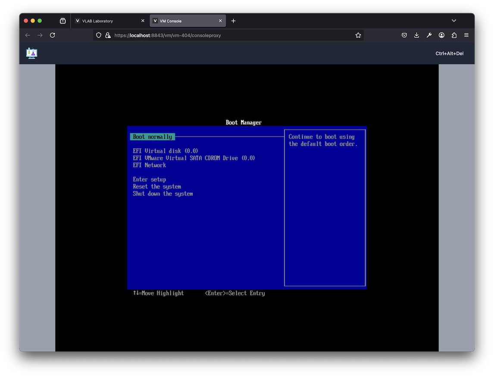
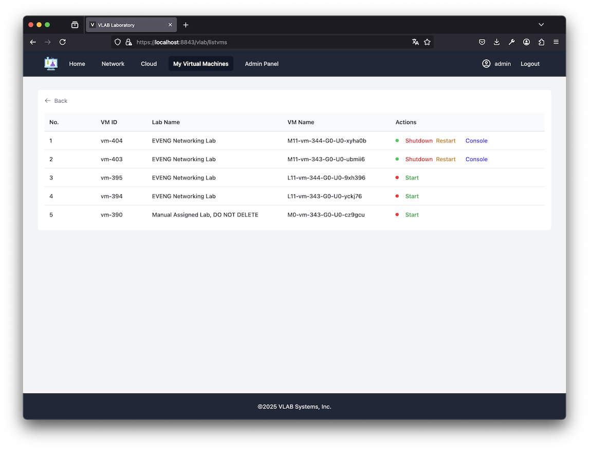
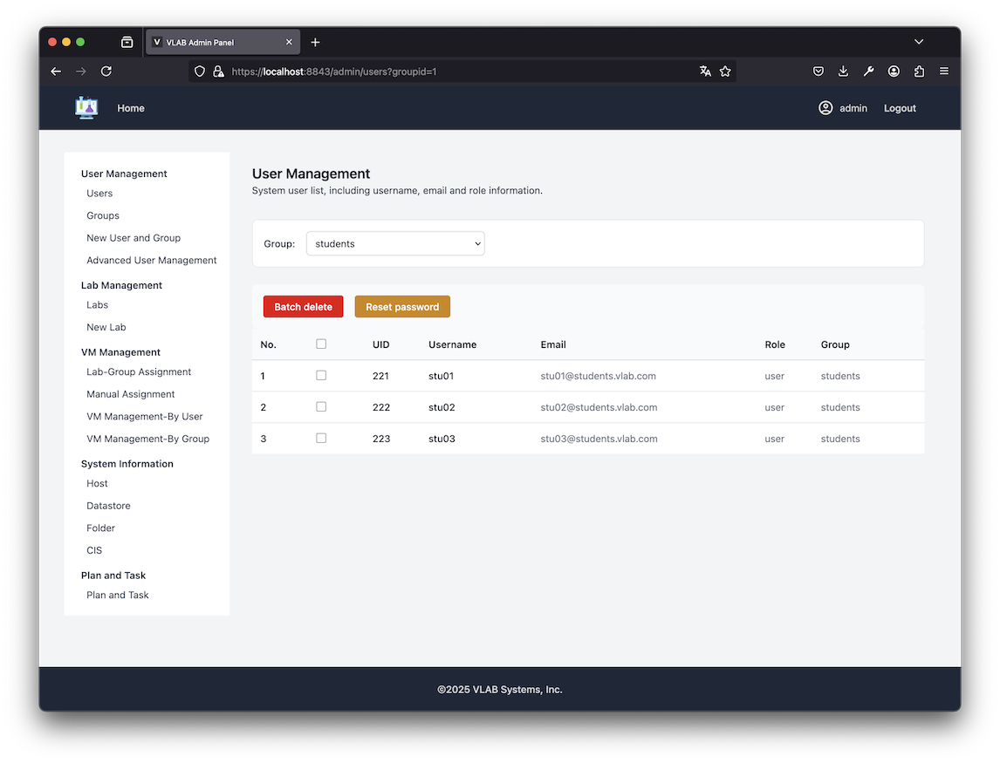
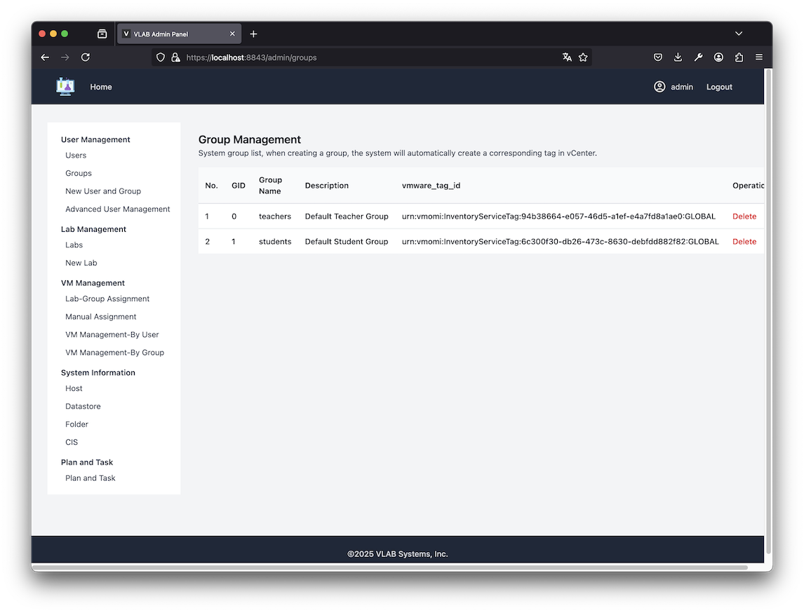
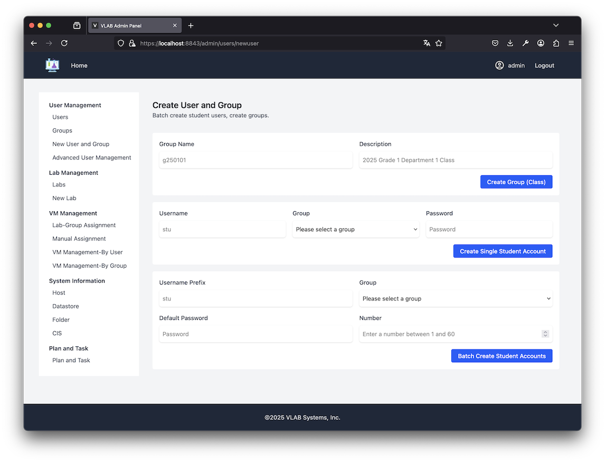
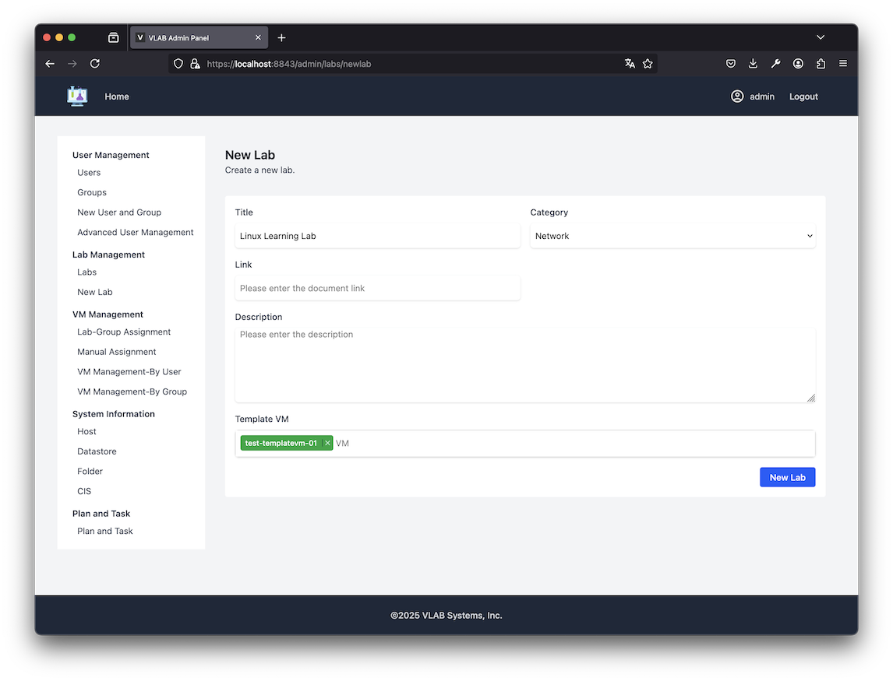
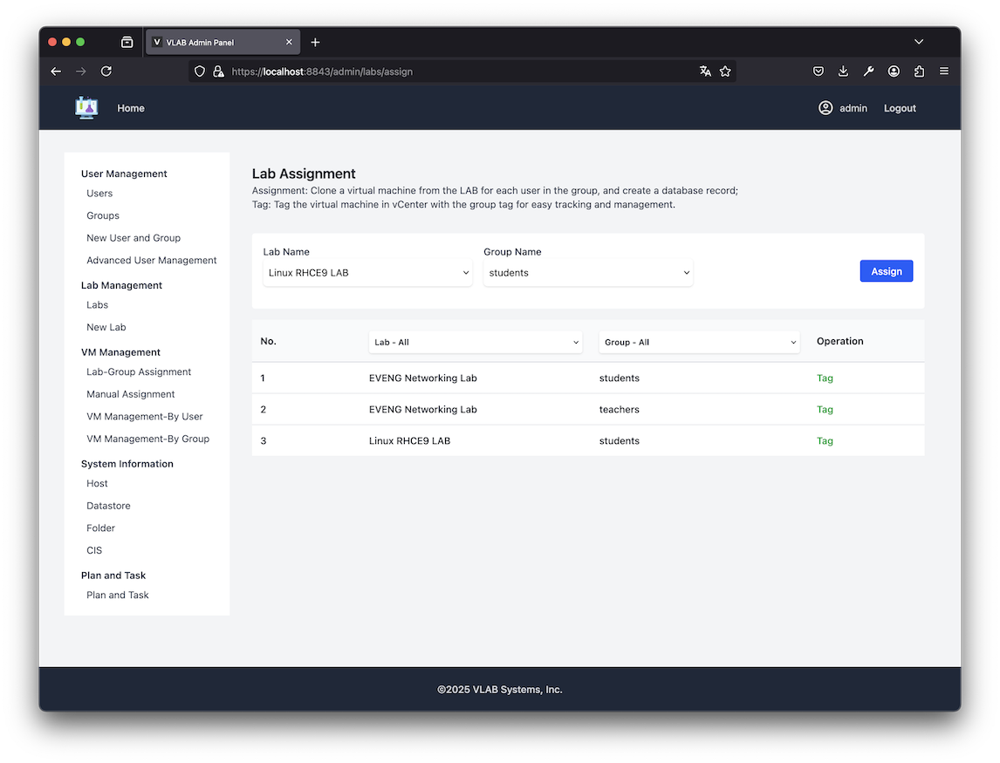
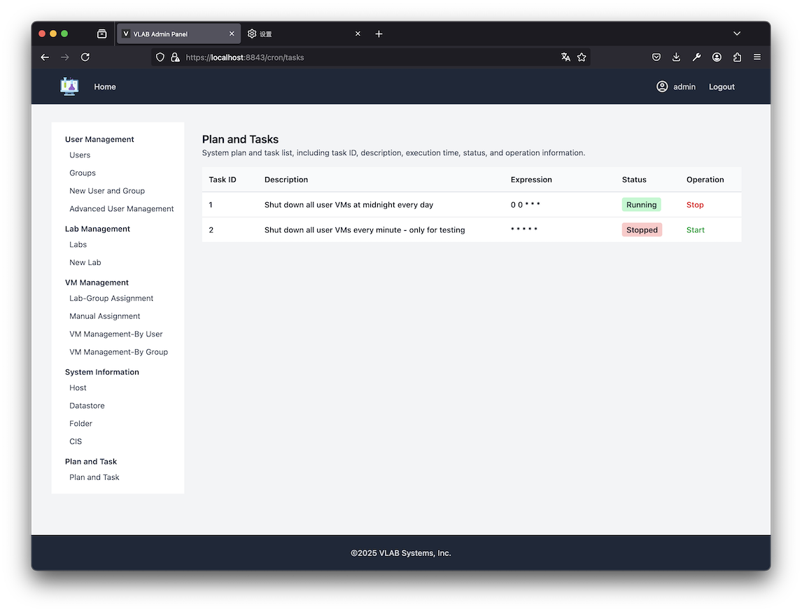
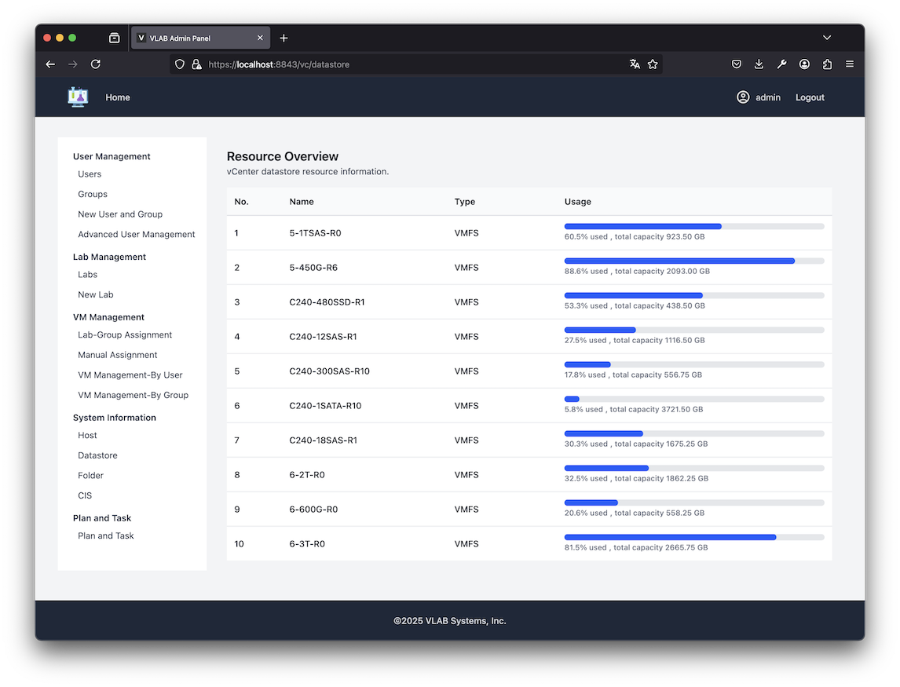

# VLAB - Virtual Lab Management System

VLAB is a virtualization lab management system built with Express.js, designed to simplify the management, cloning, and access control of virtual machines in VMware environments, providing convenience for educational scenarios. The system offers a web interface that allows instructors to easily create and manage lab environments, and provides students with convenient access.

## Features

- **User Management**: Supports multi-level user permissions (admin, advanced user, regular user)
- **Lab Management**: Create and configure different types of lab environments
- **VM Management**: Automatically clone and assign virtual machines to users or groups
- **VMware API Integration**: Integrate with vCenter server for automated operations
- **Session Management**: Use Redis to store user sessions, supporting cluster deployment
- **Reverse Proxy**: Integrated WebSocket proxy, supports direct access to ESXi hosts
- **Secure Access**: HTTPS support and user authentication

## System Architecture

VLAB adopts a multi-layer architecture:

1. **Frontend**: Web interface rendered by EJS templates
2. **Application Layer**: Node.js Express server
3. **Cache Layer**: Redis for session storage and caching
4. **Storage Layer**: PostgreSQL database
5. **Proxy Layer**: Nginx/Node.js reverse proxy
6. **Virtualization Layer**: VMware vCenter and ESXi


## Installation Guide

### Prerequisites

- Node.js 16+
- Redis 6+
- PostgreSQL 12+
- Docker (optional)
- VMware vCenter server 7.0+

### Environment Variable Configuration

Create a `.envrc` file (refer to `.envrc.example`):

```bash
# VMware vCenter configuration
export VCENTER_BASE_URL="https://vcenter.example.com"
export VCENTER_USERNAME="administrator@vsphere.local"
export VCENTER_PASSWORD="your-password"

# Database configuration
export DB_HOST="localhost"
export DB_USER="admin"
export DB_PASSWORD="your-db-password"
export DB_PORT=5432
export DB_NAME="vlab"

# Session configuration
export SESSION_SECRET="your-session-secret"

# Redis configuration
export REDIS_HOST="localhost"
export REDIS_PORT=6379
export REDIS_PASSWORD="your-redis-password"

# Proxy configuration
export PROXY_HOST="vlab.sample.com:8843"
```

### Standard Installation

```bash
# Install dependencies
npm install

# Create database (if using PostgreSQL)
psql -U postgres -c "CREATE DATABASE vlab;"
# For table creation, see the three init scripts in the db folder

# Start the application
npm run dev
npm run rproxy
# See depoyment_note.txt for details
```

### Docker Installation

Docker configuration files are provided for simplified deployment. Database and nginx can use official docker images directly:

```bash
# postgresql: main database (required)
docker-compose -f docker/docker-compose.pg.yml up -d

# For expressjs session storage (optional)
docker-compose -f docker/docker-compose.redis.yml up -d

# nginx: replaces rproxy.js as the proxy server in production (optional, do not run with rproxy at the same time)
docker-compose -f docker/docker-compose.nginx.yml up -d

# Start the application with PM2
npm install pm2 -g
pm2 start ecosystem.config.cjs
```

## User Guide

### User Operations

1. **Login**: Log in with assigned credentials
    
    

2. **Access Labs and VMs**: Connect to virtual machines via the web interface
    
    
    
    


### Admin Operations

1. **User Management**: Create users and groups, set permissions
   
   
   

2. **Lab Configuration**: Set up lab templates and VM assignment
   
   
   
   
   

3. **Schedules and Tasks**: Set shutdown schedules for lab VMs
   

## System Monitoring

The system provides a monitoring interface to display resource usage and user activity:



## Developer Guide

### Project Structure

```
├── cert/               # SSL certificates
├── config.js           # Application config
├── crontask/           # Scheduled tasks
├── db/                 # Database scripts
├── docker/             # Docker configs
├── docs/               # Documentation and screenshots
├── middleware/         # Express middleware
├── public/             # Static assets
├── routes/             # Route definitions
├── server.js           # App entry point
├── server-with-redis.js # Server with Redis support
├── rproxy.js           # Reverse proxy server
└── views/              # EJS templates
```

### Extension Guide

To add new features, follow these steps:

1. Create new routes in the `routes/` directory
2. Add necessary views to the `views/` directory
3. Update config files to support new features
4. Rebuild the frontend with React/Vue for a more modern UI

## Performance Optimization

- For production, use PM2 for cluster deployment
- Use Nginx as a frontend proxy for static assets and load balancing
- Configure proper caching and connection pooling for Redis and PostgreSQL

## Troubleshooting

Common issues and solutions:

- **Connection issues**: Ensure vCenter and ESXi hosts allow API access
- **Session issues**: Check Redis connection and configuration
- **Proxy errors**: Verify Nginx configuration and SSL certificates